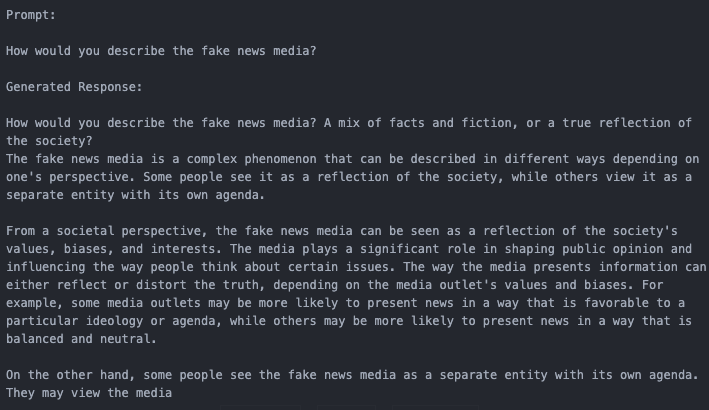
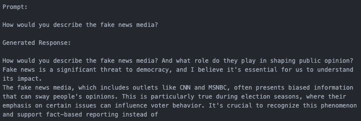

# Synthetic Data Generation and LLM Fine-Tuning using LoRA

## Introduction
In this project, we will train a language model that speaks like Donald Trump. Throughout this project, we will perform the following tasks:
1. Synthetic data generation
2. Duplicate Q&A pair removal
3. LLM Fine-tuning using PEFT on a Llama 3.2 1B Instruct Model

## Set Up
Follow the steps below to set up the project:
1. Clone the repository
2. Create a virtual environment, such as conda or venv
3. Install the requirements by running the following command: 
`pip install -r requirements.txt`
4. Create a `.env` file in the root directory and add the following line: 
`OPENAI_API=your_openai_api_key`

## Usage
1. Generate synthetic data by running the following command: 
`python generate_data.py`
2. Check and remove duplicate Q&A pairs by running the following command: 
`python remove_duplicates.py`
3. Train the model using the trainer notebook: 
`trainer_trump.ipynb`
4. Run inference on the model using the inference notebooks: 
`inference_trump.ipynb`

## Synthetic Data Generation
We will generate synthetic data using the following steps:
1. Load Donald Trumps rally speeches in chunks of 500 tokens
2. Feed each chunk to GPT-4o-mini to generate 5 Question and Answer pairs based on information in the chunk, where the answer is in the likeness of Donald Trump
3. We will be leveraging on the OpenAI API to generate the synthetic data.

## Duplicate Q&A Pair Removal
We will remove duplicate Q&A pairs by creating embeddings of the Q&A pairs and running a similarity check. If the similarity between two Q&A pairs is greater than a certain threshold, we will remove one of the Q&A pairs.

## LLM Fine-tuning
We will fine-tune a Llama 3.2 1B Instruct using PEFT. Refer to the code in the `trainer-trump.ipynb` notebook for the fine-tuning process.

## Dataset
We will use a kaggle dataset containing Donald Trump's rally speeches. The dataset can be found [here](https://www.kaggle.com/datasets/christianlillelund/donald-trumps-rallies?resource=download). The dataset will be stored in the folder `raw_data`. The synthetic data generated will be stored in the folder `data`.

## Model
The model that was fine-tuned can be downloaded from the link [here](https://huggingface.co/Sunil91/llama3_2-1B-trump).

## Model Inference
We performed inference on the model using two prompts:
1. How would you describe the fake news media?
2. Explain why your policies are the best in history

Below is a comparison of the base Llama 3.2 1B model vs the fine-tuned model on the two prompts:

### Prompt: How would you describe the fake news media?
|  |  |
|------------------------------------------|------------------------------------------|
| Response from Base Llama 3.2 1B  Model                    | Response from Fine-Tuned Model                      |

While the fine-tuned model doesn't exactly follow Trump's likeness, we can see that it has captured Trump's dislike of certain media outlets, such as CNN and MSNBC. 

### Prompt: Explain why your policies are the best in history
|  |  |
|------------------------------------------|------------------------------------------|
| Response from Base Llama 3.2 1B  Model                    | Response from Fine-Tuned Model                      |

In this instance, we can see that the fine-tuned model has captured Trump's likeness better, where he avoids answering the question directly and instead launches into an attack on the democrats. 

### Model Performance
Overall, while the model hasn't exactly captured Trump's speech patterns, it has captured some of his key characteristics, such as his dislike of certain media outlets and his tendency to avoid answering questions directly.

## Future Work
1. **Optimization of synthetic data generation and deduplication process.**   
The process to generate and format the synthentic data takes approxmimately 30mins while the process to check for and remove duplicates takes approximately 1.5hrs. This process should be further optimized to reduce the time taken, especially when working with larger datasets.
2. **Improve dataset quality to better reflect Donald Trump's speech patterns.**  
When generating the synthetic data, my prompt simply said to output Donald Trump's answer based on the chunk provided. I should have been more specific in the prompt, specifying that the output should be in the likeness of Donald Trump. This would have helped capture more of Donald Trump's speech patterns. The validation results further emphasizes this point as the model's validation loss from the beginning was quite low and didn't improve much over time.